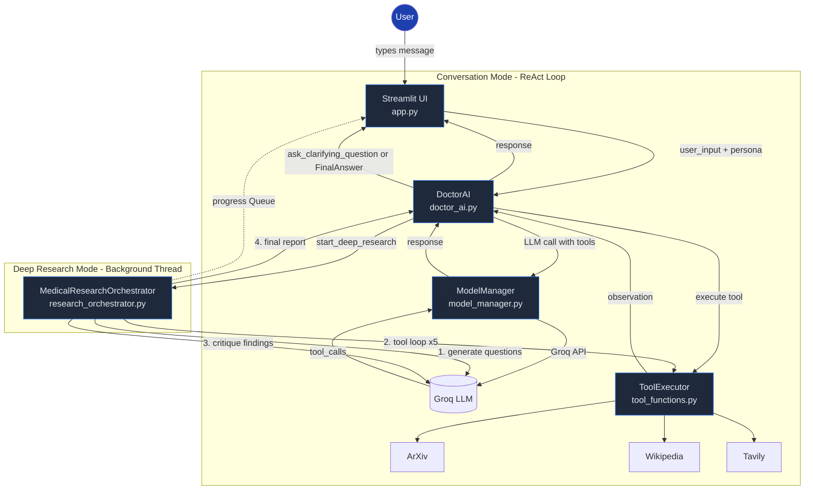

# DoctrAI - Medical AI Assistant

Conversational medical AI assistant powered by Groq LLMs with a proper ReAct agent loop, multi-tool research, and a Streamlit UI.

## Features

- **True ReAct Agent Loop** — The conversation mode runs a multi-iteration Reason+Act loop, executing tools (Tavily, Wikipedia, ArXiv) and feeding observations back to the LLM, not just a single-turn structured output parser.
- **Native Function Calling** — All actions (`ask_clarifying_question`, `FinalAnswer`, research tools) use Groq's native function-calling API instead of brittle regex-based parsing of `Thought:...Action:...` text.
- **Two Research Modes** — Quick conversational answers via the ReAct loop, or a toggleable Deep Research mode that spawns a background thread to generate research questions, run multi-tool investigations, critique findings, and produce a final report with live progress streaming.
- **Three Specialized Personas** — Symptom Checker, Medication Information, Lifestyle Advisor — each with a tailored system prompt.
- **Thread-Safe Shared State** — All shared state (sessions, research progress) is protected by `threading.Lock`.
## Architecture



## Project Structure

```
DoctrAI/
├── .env                    # API keys (GROQ_API_KEY, TAVILY_API_KEY)
├── .env.example            # Template for .env
├── .gitignore
├── README.md
├── requirements.txt
├── app.py                  # Streamlit UI (3 tabs, chat interface, polling)
├── core/
│   ├── __init__.py
│   ├── doctor_ai.py        # Agent controller: session mgmt, ReAct loop, research initiation
│   ├── model_manager.py    # Groq LLM client, model fallback, token truncation
│   ├── prompts.py          # Persona prompts + research workflow prompts
│   ├── research_orchestrator.py  # Deep research workflow (questions → tools → critique → report)
│   ├── tool_definitions.py # Groq function-calling schemas (5 tools)
│   └── tool_functions.py   # Python implementations: ArXiv, Wikipedia, Tavily
└── tests/
    ├── conftest.py          # Shared fixtures (mocked Groq, Tavily clients)
    ├── test_doctor_ai.py    # 14 tests: session mgmt, ReAct loop, research tool dispatch
    ├── test_model_manager.py # 11 tests: fallback, truncation, create_completion
    ├── test_prompts.py      # 5 tests: persona selection, prompt content
    ├── test_research_orchestrator.py # 13 tests: question gen, tool loop, critique, full workflow
    ├── test_tool_definitions.py # 7 tests: schema structure and required fields
    └── test_tool_functions.py # 10 tests: each tool's success/error paths, dispatch table
```

## Setup

```bash
git clone https://github.com/shivammishrr/DoctrAI.git
cd DoctrAI
python -m venv venv
source venv/bin/activate   # Windows: venv\Scripts\activate
pip install -r requirements.txt
cp .env.example .env       # Then edit .env with your API keys
```

Required API keys:
- `GROQ_API_KEY` — from [console.groq.com](https://console.groq.com)
- `TAVILY_API_KEY` — from [app.tavily.com](https://app.tavily.com)

## Running

```bash
streamlit run app.py
```

## Testing

```bash
pytest tests/ -v
```

All 67 tests use mocks — no API keys required. CI-ready.

## Disclaimer

This tool provides AI-generated information for educational purposes only. Not a substitute for professional medical advice.
