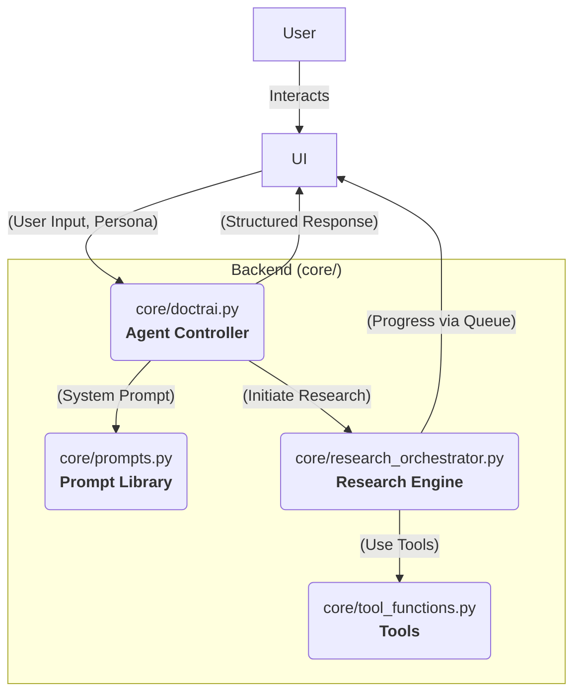

# DoctrAI - Advanced Conversational Medical Assistant

DoctrAI has been re-architected into a state-of-the-art conversational agent. It provides specialized medical advice and orchestrates deep research through a dynamic, chat-based interface built with Streamlit and powered by the Groq engine.

## Key Features

- **Agentic Conversational Core (ReAct Framework):** At its heart, DoctrAI is no longer a simple Q&A bot. It operates on a Reason+Act (ReAct) loop, allowing it to reason about the user's query, ask clarifying questions, and intelligently decide when to use its tools.
- **Specialized Agent Personas:** The agent adopts a unique persona for each task—Symptom Checker, Medication Information, or Lifestyle Advisor—using tailored system prompts to provide more focused and effective conversational assistance.
- **Interactive & Transparent Deep Research:** When deep research is initiated, the UI provides a stable, real-time, flicker-free stream of updates directly in the chat window. Users can watch the agent generate research questions, call tools, and synthesize findings as it happens.
- **Context-Aware Deep Research Toggle:** A user-friendly toggle allows users to grant the agent pre-approval for deep research on their next query, enabling a powerful, direct-to-research workflow while maintaining a conversational flow by default.
- **Multi-Tool Integration:** The research engine seamlessly uses multiple tools (e.g., Tavily, ArXiv, Wikipedia, Google Search) orchestrated by an LLM to gather comprehensive information from various sources.

## Architecture Overview

The system is built on a modern, decoupled architecture designed for robust, stateful conversations.



- **UI (app.py):** A beautiful and responsive chat interface. Its only job is to render the conversation and pass user input to the Agent Controller.
- **Agent Controller (doctrai.py):** The brain of the system. It manages conversation state, runs the ReAct loop, and decides which actions to take.
- **Research Engine (research_orchestrator.py):** A powerful, non-blocking service that executes the deep research workflow in a background thread when called by the agent.
- **Prompt Library (prompts.py):** A centralized and maintainable collection of all system prompts, including the base ReAct framework and the specialized personas.

## Project Structure

```
Medical_AI_Assistant/
├── .env                   # For API keys (GROQ_API_KEY, TAVILY_API_KEY, etc.)
├── README.md
├── requirements.txt
├── app.py                 # Main Streamlit application (UI Layer)
└── core/
    ├── __init__.py
    ├── doctrai.py         # The core ReAct agent controller
    ├── prompts.py         # Centralized library for all system prompts
    ├── model_manager.py   # Manages all LLM API calls (Groq)
    ├── research_orchestrator.py # Orchestrates the deep research workflow
    ├── tool_definitions.py  # Schemas for tools (Groq format)
    └── tool_functions.py    # Python implementations of the research tools
```

## Setup

1. **Clone the repository:**
    ```bash
    git clone https://github.com/shivammishrr/DoctrAI.git
    cd Medical_AI_Assistant
    ```

2. **Create a virtual environment (recommended):**
    ```bash
    python -m venv venv
    source venv/bin/activate  # On Windows: venv\Scripts\activate
    ```

3. **Install dependencies:**
    ```bash
    pip install -r requirements.txt
    ```

4. **Set up API Keys:**
    Create a `.env` file in the root directory (`Medical_AI_Assistant/`) and add your API keys:
    ```env
    GROQ_API_KEY="your_groq_api_key"
    TAVILY_API_KEY="your_tavily_api_key"
    # Add any other API keys if needed
    ```

## Running the Application

Once the setup is complete, run the Streamlit application:

```bash
streamlit run app.py
```

The application will open in your web browser, presenting the tab-based conversational interface.

## Disclaimer

This tool provides AI-generated information for educational purposes only. It is not a substitute for professional medical advice, diagnosis, or treatment. Always seek the advice of your physician or other qualified health provider with any questions you may have regarding a medical condition.
